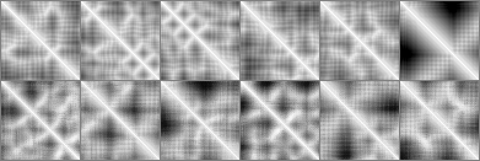

# folduzz

An experimental DCGAN trained on residue-residue distance matrices taken from
PDB crystal structures. It learns to generate 64x64 CA-CA distance maps that
look like protein windows and have close to the right statistics, but that are
**not** valid 3D structures: 2.5% of residue triples break the triangle
inequality, the matrices are asymmetric by 2.0 A on average, and projecting them
into 3D with classical MDS gives a stress-1 of 0.12 and a chain whose virtual
bonds are correct only 30% of the time.

This README reports what the code does and what the evaluation measured,
including the failure modes. The numbers below come from one run on this
repository's own data and are reproducible with the commands in
[How to run](#how-to-run).



*Top row: six real held-out 64-residue windows. Bottom row: six samples from the
trained generator. Bright = close, dark = far. The samples have a bright
diagonal and blocky off-diagonal contacts, like the real ones; they are also
visibly smoother, and the structure in them does not survive the geometric
checks below.*

---

## What it actually does

1. **fetch** -- downloads PDB entries from RCSB, one request at a time, resumable.
2. **preprocess** -- for each chain, takes the CA atom of every standard residue,
   splits the chain wherever consecutive CA atoms are more than 4.5 A apart
   (a chain break), crops the remaining runs into overlapping 64-residue windows
   (stride 32, no padding), and converts each window to a 64x64 Euclidean
   distance matrix scaled into [-1, 1].
3. **train** -- a DCGAN (transposed-conv generator, strided-conv discriminator,
   BCEWithLogitsLoss, Adam, one-sided label smoothing) over those matrices.
4. **generate** -- samples matrices from a checkpoint, optionally symmetrising them.
5. **evaluate** -- scores the samples on validity, distribution match, 3D
   embeddability and memorisation/diversity, against real held-out windows and
   three trivial baselines.

### The data contract

Every matrix the model sees is

```
value = 2 * clip(d_angstrom, 0, 50) / 50 - 1
```

so `-1` is 0 A and `+1` is 50 A or more. The scale is a **fixed global
constant**, not a per-matrix min/max, which is what makes a generated matrix
interpretable in angstroms. 50 A was chosen from the data: over the training
windows the CA-CA distance distribution has p50 = 17.3 A, p99 = 47.9 A and a
maximum of 74.3 A, so clipping at 50 A saturates 0.31% of entries in the final
dataset (40 A would have saturated 3.7%).

`data/processed/manifest.json` records these constants plus the PDB ID, chain
and residue offset of every single window, and each checkpoint carries a copy of
the contract, so a saved generator is never ambiguous about what its numbers
mean.

---

## Data provenance

`data/pdb_ids.txt` holds 800 PDB IDs. They come from the RCSB Search API query
in `data/rcsb_query.json`: X-ray structures at <= 2.0 A resolution, protein
only, exactly one protein polymer entity, 80-400 residues, reduced to one
representative per 30%-sequence-identity cluster. That query returned 11,605
cluster representatives on 2026-10-01. 767 were sampled from them
deterministically by `blake2b("folduzz-sample:<ID>")` rank, plus the 33
hand-picked IDs from this repository's first commit.

To regenerate the list:

```bash
curl -s -X POST https://search.rcsb.org/rcsbsearch/v2/query \
  -H 'Content-Type: application/json' -d @data/rcsb_query.json
```

What that yields in practice:

| stage | count |
|---|---|
| IDs requested | 800 |
| downloaded from RCSB | 787 |
| 404 (entry has no legacy PDB-format file) | 13 |
| structures with at least one usable 64-residue run | 735 |
| structures skipped (too short, or no contiguous 64-residue run) | 54 |
| 64x64 windows produced | 7,230 |
| train / validation windows | 6,187 / 1,043 |
| raw PDB files on disk | 340 MB |
| processed arrays on disk | 119 MB |

The train/validation split is decided **per structure**, by hashing the PDB ID,
never per window: overlapping windows from one chain are near-duplicates, so
splitting them individually would leak the validation set into training.

### What is and is not in git

Bulk data is **not** committed. `data/raw/`, `data/processed/`, `data/generated/`,
`runs/` and checkpoints are gitignored and reproduced by `fetch` + `preprocess` +
`train`. What is committed: the ID list, the search query, the evaluation
reports, and `data/fixtures/` -- six real PDB files (~500 KB) that let the whole
pipeline and its tests run without downloading anything.

An earlier version of this repository committed `data/processed/*.csv` through
Git LFS. The LFS objects were never reachable, so every "distance matrix" in the
repository was a 130-byte pointer file. Those are gone.

---

## How to run

Requires Python 3.11-3.13 and [uv](https://docs.astral.sh/uv/).

```bash
uv venv && uv pip install -e ".[dev]"
source .venv/bin/activate

folduzz fetch                       # ~790 PDB files, ~340 MB, ~10 min (polite: ~3 req/s)
folduzz preprocess                  # -> data/processed/{train,val}.npy + manifest.json
folduzz train --run-dir runs/dcgan-v1
folduzz generate --checkpoint runs/dcgan-v1/last.pt \
                 --out data/generated/samples.npy --count 512
folduzz evaluate --samples data/generated/samples.npy --out reports
```

Every command takes `--help`. Useful flags: `fetch --limit N`, `preprocess
--matrix-size/--stride/--max-distance`, `train --epochs/--batch-size/--device
/--resume`, `generate --symmetrize`, `evaluate --split/--embed-count`.

Try the whole pipeline on the committed fixtures, no download needed:

```bash
folduzz preprocess --raw data/fixtures/raw --out /tmp/fx
folduzz train --data /tmp/fx --run-dir /tmp/fx-run --epochs 5 --batch-size 4
```

### The run reported here

| | |
|---|---|
| hardware | Apple M3 Pro, 18 GB, PyTorch MPS backend |
| training set | 6,187 windows of 64x64 |
| hyperparameters | 120 epochs, batch 64, Adam lr 2e-4, betas (0.5, 0.999), latent 100, real label 0.9 |
| generator / discriminator parameters | 1,099,681 / 694,113 |
| wall clock | 917 s (~15 min), 4-15 s per epoch |
| final losses | D 0.352, G 4.969 |
| final discriminator confidence | D(real) 0.887, D(fake) 0.013 |

---

## Results

512 samples from the epoch-120 checkpoint, scored against 1,043 held-out real
windows. Full numbers in [`reports/evaluation.json`](reports/evaluation.json);
this table is [`reports/evaluation.md`](reports/evaluation.md).

| source | symmetry err (A) | diag err (A) | triangle viol | bond mean (A) | bond ok | contact dens | rel contact order | Rg (A) | dist JS | dist W1 (A) | MDS stress-1 | neg eig mass | 3D bond ok | NN RMSE (A) | self div (A) | coverage |
|---|---|---|---|---|---|---|---|---|---|---|---|---|---|---|---|---|
| **dcgan (raw)** | 2.01 | 0.46 | 2.54% | 4.24 | 50.2% | 0.030 | 0.285 | 13.8 | 0.007 | 0.39 | 0.122 | 0.195 | 30.1% | 5.28 | 9.69 | 0.86 |
| **dcgan (symmetrised)** | 0.00 | 0.00 | 1.93% | 4.25 | 53.4% | 0.023 | 0.258 | 13.7 | 0.006 | 0.51 | 0.122 | 0.195 | 30.1% | 5.04 | 9.43 | 0.86 |
| real held-out | 0.00 | 0.00 | 0.00% | 3.81 | 99.7% | 0.032 | 0.311 | 14.0 | 0.000 | 0.00 | 0.002 | 0.003 | 97.6% | 4.69 | 9.85 | 0.55 |
| baseline: Gaussian | 10.18 | 17.86 | 12.46% | 17.94 | 1.3% | 0.145 | 0.391 | 14.2 | 0.044 | 1.01 | 0.469 | 0.389 | 2.1% | 11.22 | 12.90 | 0.09 |
| baseline: shuffled distances | 0.00 | 0.00 | 9.57% | 18.12 | 3.1% | 0.121 | 0.390 | 14.0 | 0.000 | 0.03 | 0.475 | 0.410 | 1.6% | 10.39 | 12.51 | 0.17 |
| baseline: residue-permuted | 0.00 | 0.00 | 0.00% | 18.11 | 3.1% | 0.121 | 0.391 | 14.0 | 0.000 | 0.03 | 0.004 | 0.005 | 3.1% | 10.28 | 12.51 | 0.37 |

### What the metrics are

* **symmetry / diagonal error** -- mean `|M - M^T|` and mean `|M_ii|`, in angstroms.
* **triangle viol** -- share of all 64^3 (i, j, k) triples with
  `d_ik > d_ij + d_jk + 0.05 A`.
* **bond mean / bond ok** -- the first off-diagonal, which should be the 3.8 A
  CA-CA virtual bond; "ok" is the share within +/- 0.5 A.
* **contact dens / rel contact order** -- fraction of residue pairs under 8 A
  with `|i - j| >= 6`, and their mean sequence separation over chain length.
* **Rg** -- radius of gyration, computed from distances alone.
* **dist JS / W1** -- Jensen-Shannon divergence (bits, 40 bins) and
  1-Wasserstein distance (A) between the full pairwise distance distributions.
* **MDS stress-1 / neg eig mass / 3D bond ok** -- classical MDS into 3D: Kruskal
  stress-1, the share of absolute eigenvalue mass that is negative (how
  non-Euclidean the matrix is), and bond plausibility of the embedded chain.
* **NN RMSE / self div / coverage** -- entrywise RMSE to the closest *training*
  matrix (memorisation), mean pairwise RMSE among samples (mode collapse), and
  the share of samples whose nearest training neighbour is distinct.

### The baselines, and why they are there

Each baseline is deliberately excellent at one thing and hopeless at the rest,
so no single good number can be mistaken for success:

* **Gaussian** -- i.i.d. normal entries matched to the real mean and standard
  deviation. The floor: right magnitudes, nothing else, not even symmetry.
* **shuffled distances** -- a real matrix with its upper triangle permuted and
  mirrored. It has the real distance histogram *exactly* (JS 0.000, W1 0.03 A)
  and perfect symmetry, and is still geometric nonsense: 9.57% triangle
  violations, MDS stress 0.475. A matching distance histogram proves very little.
* **residue-permuted** -- a real matrix with rows and columns jointly permuted.
  It is still an exact Euclidean distance matrix of the same points, relabelled:
  perfect on every validity metric, MDS stress 0.004 -- and useless as a protein,
  with a 18.1 A "bond" length and 3.1% plausible bonds. Perfect validity proves
  very little either.

### Reading the results honestly

**What the model learned.** It beats every baseline on the things that require
actually modelling protein geometry. Triangle violations are 2.54% against 9.57%
for a matrix with the identical distance histogram, and 12.46% for noise. The
first off-diagonal averages 4.24 A against a true 3.81 A, when a structureless
baseline sits at 18 A -- the generator learned that neighbouring residues are
close, a fact nothing in the architecture told it. Contact density (0.030 vs
0.032), relative contact order (0.285 vs 0.311) and radius of gyration (13.8 A
vs 14.0 A) are all within ~10% of the real distributions, and the pairwise
distance histogram is close (JS 0.007 against 0.044 for noise).

**It is not memorising or collapsing.** Mean RMSE to the nearest training matrix
is 5.28 A, slightly *further* than real held-out windows sit from the training
set (4.69 A), so the samples are not copies. Self-diversity is 9.69 A against
9.85 A for real windows, and 86% of samples pick a distinct nearest neighbour,
so there is no mode collapse. A GAN on 6,187 examples could easily have done
either; this one did not.

**What it did not learn, and this is the headline.** The output is not a valid
distance matrix:

* **Symmetry is never learned.** `M` and `M^T` differ by 2.01 A on average and
  the gap stops improving after ~60 epochs. Nothing in a DCGAN makes `M_ij` and
  `M_ji` the same pixel, and the discriminator evidently cannot force it.
  Symmetrising afterwards is free and fixes it exactly, which is why the model
  never had to.
* **The diagonal is off by 0.46 A.** The model does not quite learn that a
  residue is at distance zero from itself.
* **The triangle inequality is broken on 2.54% of triples** -- roughly 6,700 of
  the 262,144 triples in every 64x64 sample. Real windows break it on 0.00%.
* **3D embedding fails.** 19.5% of the eigenvalue mass of the double-centred
  matrix is negative (real: 0.3%), i.e. these matrices are substantially
  non-Euclidean. MDS stress-1 is 0.122, where below ~0.05 would be a good fit
  and real windows score 0.002. After embedding, only 30.1% of consecutive
  residues land within 0.5 A of a 3.8 A bond, against 97.6% for real windows.
  The embedded chains are not polypeptides.
* **Symmetrising helps less than it looks.** It zeroes the symmetry and diagonal
  errors by construction and cuts triangle violations from 2.54% to 1.93%, but
  MDS stress and negative eigenvalue mass do not move at all (0.122, 0.195) --
  classical MDS symmetrises internally anyway, so the 3D failure was never about
  asymmetry. Averaging also pulls contact density down from 0.030 to 0.023,
  further from the real 0.032.

**Training longer does not fix it.** Scoring every saved checkpoint:

| epoch | symmetry (A) | triangle viol | bond (A) | bond ok | dist JS | MDS stress-1 | 3D bond ok |
|---|---|---|---|---|---|---|---|
| 20 | 2.94 | 2.89% | 4.18 | 45% | 0.0124 | 0.136 | 23% |
| 40 | 2.28 | 3.11% | 4.08 | 60% | 0.0084 | 0.127 | 25% |
| 60 | 2.04 | 2.80% | 3.91 | 63% | 0.0084 | 0.123 | 26% |
| 80 | 1.99 | 2.74% | 4.16 | 55% | 0.0071 | 0.125 | 27% |
| 100 | 2.11 | 2.78% | 4.28 | 46% | 0.0067 | 0.124 | 30% |
| 120 | 2.01 | 2.54% | 4.24 | 50% | 0.0069 | 0.123 | 30% |

Everything geometric plateaus by epoch 60: symmetry error stops at ~2 A, stress
at ~0.123. Only the distance histogram keeps improving, which is the metric a
discriminator is best placed to drive. Meanwhile D(fake) fell from 0.29 to 0.013
and the generator loss rose from 1.8 to 4.97 -- the discriminator wins, and the
generator is still not being pushed toward geometric consistency, because
nothing in the adversarial objective asks for it. Epoch 60 has the best bond
statistics (3.91 A, 63% plausible) and epoch 120 the best histogram and triangle
rate; no checkpoint dominates.

---

## Limitations

* **These are not protein structures.** They are 64x64 images with protein-like
  second-order statistics. Converting one to coordinates loses a fifth of the
  eigenvalue mass to negative eigenvalues and yields a chain with implausible
  bonds. Nothing here predicts, folds or designs a protein.
* **A window is not a domain.** Each sample is 64 consecutive residues cropped
  out of a larger chain, so the long-range contacts that define a fold are
  mostly outside the frame.
* **Only CA atoms, only the first model, only one chain at a time.** No side
  chains, no backbone geometry beyond CA-CA distances, no quaternary structure.
* **Clipping at 50 A** saturates 0.31% of real entries, and the generator cannot
  express anything beyond 50 A at all.
* **Scale is small.** 735 structures and 6,187 windows is a small dataset for a
  GAN, and overlapping windows make the effective count smaller still.
* **No held-out structural validation.** The evaluation compares distributions
  and geometry; it does not check whether any sample resembles a real fold.
* **The obvious fixes are not implemented.** Predicting only the upper triangle,
  or adding a triangle-inequality or Gram-matrix penalty, or generating
  coordinates and deriving distances from them, would each address a specific
  failure above. This repository measures the problem rather than solving it.

---

## Repository layout

```
src/folduzz/
  config.py          every constant: matrix size, distance clip, hyperparameters
  errors.py          typed exceptions
  cli.py             argument validation and the five subcommands
  fetch.py           polite, resumable RCSB downloads
  pdb_parse.py       CA extraction, chain-break splitting
  distance.py        distance matrices, windowing, normalisation
  splits.py          deterministic per-structure train/val split
  preprocess.py      raw PDB -> train.npy / val.npy / manifest.json
  dataset.py         validated torch Dataset
  checkpoints.py     checkpoint format (carries the data contract), device choice
  train.py           DCGAN training loop, JSONL logging, resume
  generate.py        sampling with a seeded, batching-independent noise draw
  evaluate.py        report assembly (JSON + Markdown + PNG)
  preview.py         grayscale PNG writer, no plotting dependency
  models/
    generator.py     transposed-conv stack, Tanh output
    discriminator.py strided-conv stack, logit output
    ops.py           stage arithmetic, symmetrise
  metrics/
    validity.py      symmetry, diagonal, triangle inequality, bond length
    stats.py         contact density/order, Rg, distance histogram, JS, Wasserstein
    embedding.py     classical MDS, stress-1, eigenvalue mass
    nearest.py       nearest-neighbour RMSE, diversity, coverage
    baselines.py     Gaussian, shuffled, residue-permuted controls
tests/               329 tests, 94% statement coverage (training loop excluded)
data/fixtures/       six real PDB files so everything runs without a download
reports/             the evaluation reported above
```

## Development

```bash
uv pip install -e ".[dev]"
pytest                               # 329 tests, ~20 s
pytest --cov --cov-report=term-missing
ruff check src tests
```

The tests use real PDB fixtures for the pipeline and synthetic geometry
(straight chains, helices, random point clouds) for the metrics, so every metric
is pinned to a case where its correct value is known analytically.

## History

This started as a half-finished project whose README described files that did
not exist. The approach -- a DCGAN over CA-CA distance matrices -- is kept; the
code around it was repaired. The training script had never run (its loss call
was missing an argument); the discriminator emitted 25 numbers per sample
instead of 1; the generator built 32x32 images and bilinearly upsampled them;
the preprocessing script imported a module and called it as a class, merged all
chains of a structure into one matrix, zero-padded short chains and normalised
away the angstrom scale. Each fix is a separate commit with the details.

## License

MIT -- see [LICENSE](LICENSE).

Structure data is from the [RCSB PDB](https://www.rcsb.org/); PDB coordinate
data is in the public domain.
